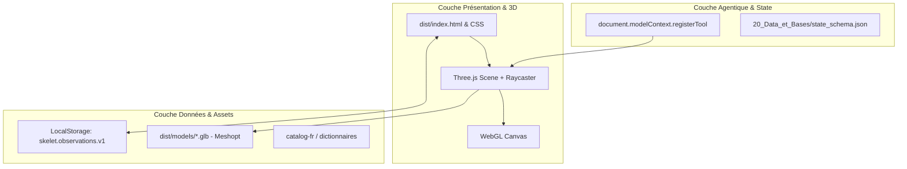

# Design System & Architecture Technique (design.md)

## 1. Architecture Applicative

## 2. Architecture Cognitive & Protocole SKILL.state
- **Schéma d'État Canonique ($\Sigma$)** : Modélisé dans [20_Data_et_Bases/state_schema.json](file:///e:/01%20-%20PROJETS/skelet/20_Data_et_Bases/state_schema.json).
- **Format de Transition d'État** :
  - Prompt immuable $P$ (règles et spec).
  - État structuré $\Sigma_t$ (sélection active, région, filtres de couches, observations).
  - Observation $O_t$ (interaction utilisateur, résultat raycasting).
- **Opérateur de Fusion** : $\Sigma_{t+1} \leftarrow \Sigma_t \oplus \Delta\Sigma_t$.
